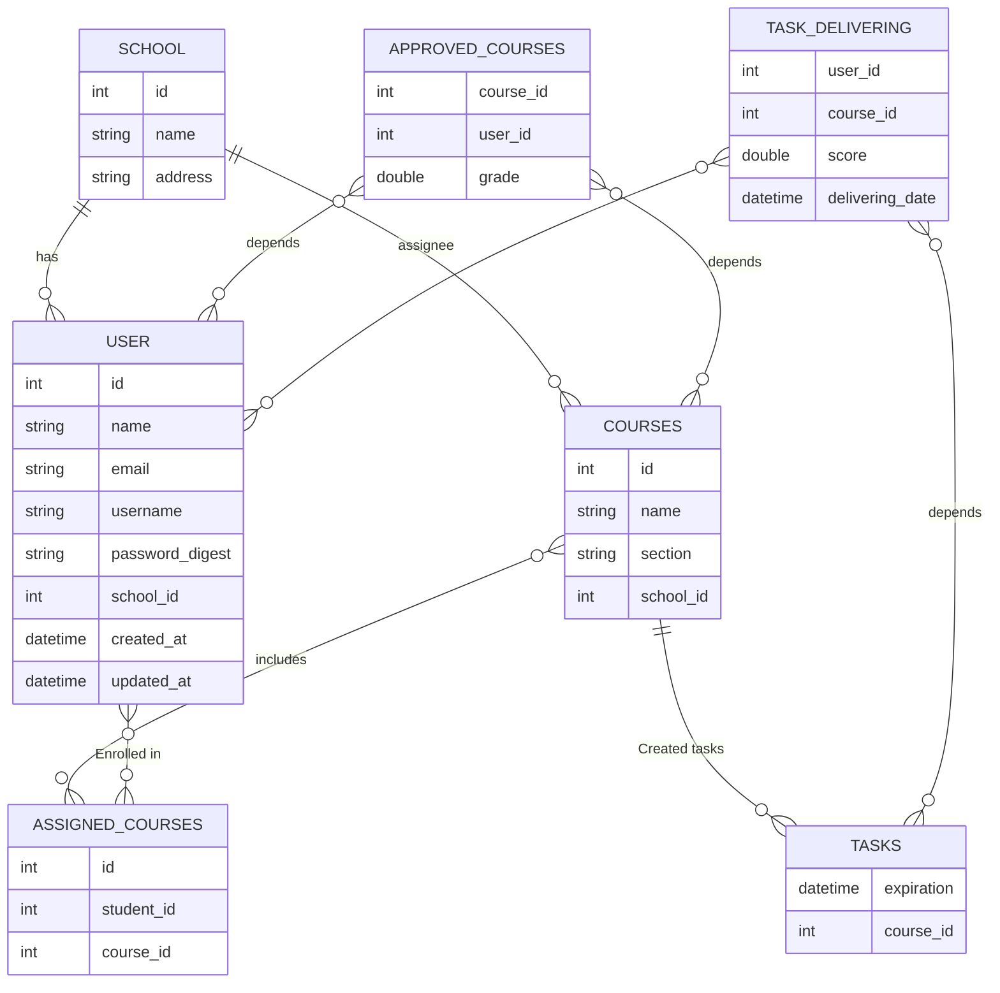

# ERD - Entity relationship Diagrams

The Entity-Relationship Diagram (ERD) for the "School Management" project provides a concise graphical overview of the database structure, showcasing the interactions between entities such as Students, Teachers, Courses, and Grades. It highlights key relationships and attributes essential for managing school administration data, serving as an essential tool for developers and administrators in maintaining and updating the database system. This ERD ensures a clear understanding of the data framework necessary for efficient educational institution management.

