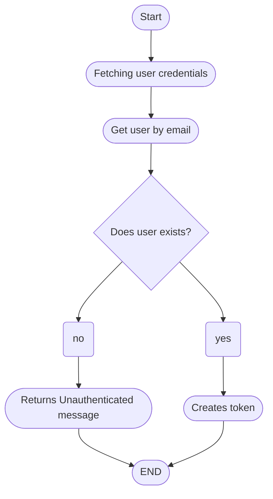

# Authentication diagram

In this section we are going to review how the authentication process works

## Register

```mermaid

flowchart
    id1([Start]) --> id2([Fetching user credentials])
    id2 --> id3([Get user by email])
    id3 --> id4{Does user exists?}
    id4 --> id6(no)
    id6 --> id7([Returns Unauthenticated message])
    id7 --> id9
    id4 --> id5(yes)
    id5 --> id8([Creates token])
    id8 --> id9([END])


```
