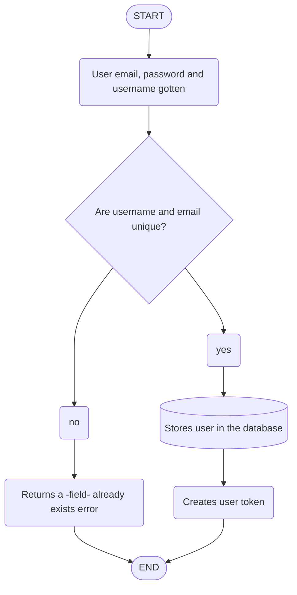
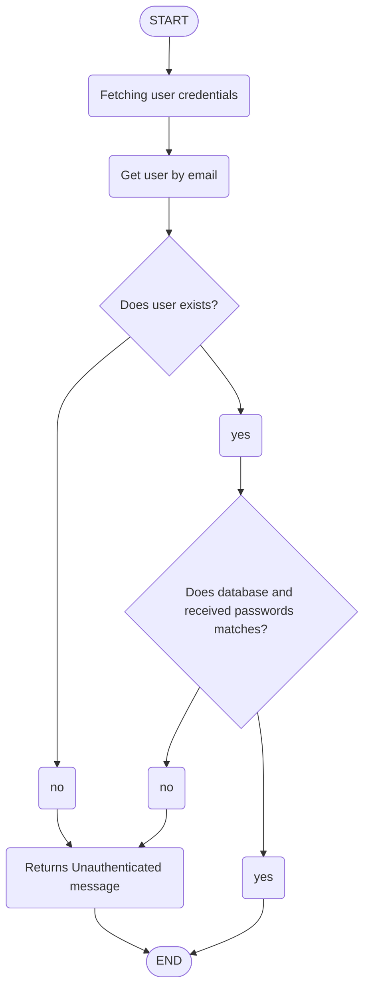

# Authentication diagram

In this section we are going to review how the authentication process works, all the logic is stored in the `AuthenticationController.rb` file.

## Register

```mermaid
flowchart
    id1([START]) --> id2(User email, password and username gotten)
    id2 --> id3{Are username and email unique?}
    id3 --> id5(no)
    id5 --> id6(Returns a -field- already exists error)
    id3 --> id4(yes)
    id4 --> id7[(Stores user in the database)]
    id7 --> id8(Creates user token)
    id6 --> id9
    id8 --> id9([END])
```

## Login

```mermaid
flowchart
    id1([START]) --> id2(Fetching user credentials)
    id2 --> id3(Get user by email)
    id3 --> id4{Does user exists?}
    id4 --> id6(no)
    id6 --> id7(Returns Unauthenticated message)
    id7 --> id9
    id4 --> id5(yes)
    id5 --> id8{Does database and received passwords matches?}
    id8 --> id10(no)
    id10 --> id7
    id8 --> id11(yes)
    id11 --> id9([END])

```
