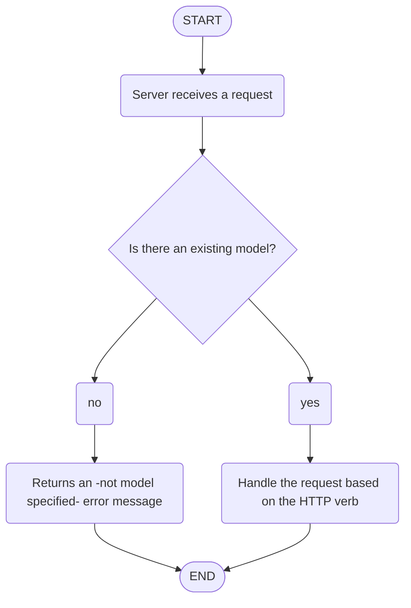

# Base controller

The `BaseController` class in this Ruby on Rails code snippet is designed as a generic controller to handle basic CRUD (Create, Read, Update, Delete) operations for a model. It serves as a template for other controllers to inherit from, providing a standardized way to perform common actions without duplicating code across multiple controllers.

### Controllers using baseController

- `coursesController.rb` -> /courses

## Base controller diagram

